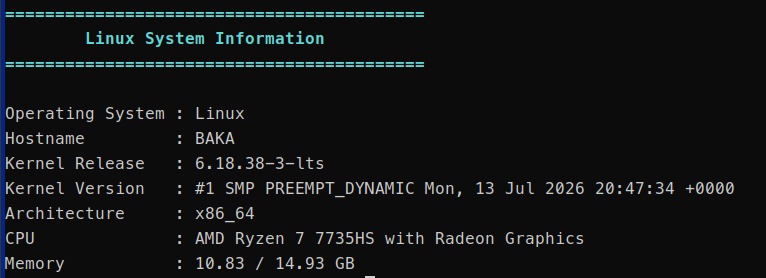

# Linux System Information

A lightweight Linux system information utility written in C++ for Linux.

## Preview



## Features

- Operating System
- Hostname
- Kernel Release
- Architecture
- CPU Information
- Memory Usage

## Technologies

- C++17
- Linux System Calls (`uname`)
- `/proc` filesystem
- Makefile
- Git

## Build

```bash
make
```

## Run

```bash
./systeminfo
```
## Requirements

- Linux
- C++17 compatible compiler (GCC 8+ or Clang 7+)
- GNU Make

## Build

```bash
git clone https://github.com/baka-arch/linux-system-info.git
cd linux-system-info
make
./linux-system-info
```


## Example Output

```text
==========================================
        Linux System Information
==========================================

Operating System : Linux
Hostname         : BAKA
Kernel Release   : 6.18.38-3-lts
Architecture     : x86_64
CPU              : AMD Ryzen 7 7735HS with Radeon Graphics
Memory           : 10.65 / 14.93 GB
```

## Future Improvements

- [ ] System Uptime
- [ ] Disk Usage
- [ ] Battery Information
- [ ] Network Interfaces
- [ ] CPU Usage
- [ ] JSON Output

